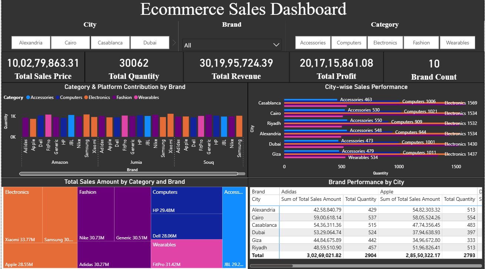

# 🛒 Ecommerce Sales Dashboard (Power BI)

## Overview
This repository contains a comprehensive **Power BI dashboard** that visualizes key performance indicators for an ecommerce business across multiple cities, brands, and product categories. The dashboard is designed to help stakeholders monitor sales, identify trends, and make data-driven decisions.

## 📊 Key Metrics
- **Total Sales Price**: ₹10,02,79,863.31  
- **Total Quantity Sold**: 30,062  
- **Total Revenue**: ₹30,19,95,724.39  
- **Total Profit**: ₹20,17,15,861.08  
- **Brand Count**: 10  

## 🖼️ Dashboard Preview

## 🔍 Dashboard Features

### 🎯 Filters
- **City Filter**: Alexandria, Cairo, Casablanca, Dubai, Giza, Riyadh  
- **Brand Filter**: Select from 10 brands  
- **Category Filter**: Accessories, Computers, Electronics, Fashion, Wearables  

### 📈 Visualizations
- **Category & Platform Contribution by Brand**  
  Bar chart showing quantity sold by brand across platforms (Amazon, Jumia, Souq) and categories.

- **City-wise Sales Performance**  
  Horizontal bar chart showing quantity sold by category in each city.

- **Total Sales Amount by Category and Brand**  
  Treemap visualizing sales amount for each brand within categories:
  - Electronics: Xiaomi ₹33.77M, Samsung ₹30.30M, Apple ₹28.55M  
  - Fashion: Nike ₹30.73M, Generic ₹30.51M, Adidas ₹30.27M  
  - Computers: HP ₹29.48M, Dell ₹28.06M  
  - Wearables: FitPro ₹31.42M  
  - Accessories: JBL ₹29.92M  

- **Brand Performance by City**  
  Table showing sales amount and quantity for Adidas and Apple across cities.

## 📂 Repository Structure
- `data/` → Sample datasets used for dashboard creation  
- `pbix/` → Power BI project file (`Ecommerce Sales Dashboard.pbix`)  
- `images/` → Dashboard screenshots  
- `README.md` → Project documentation  
